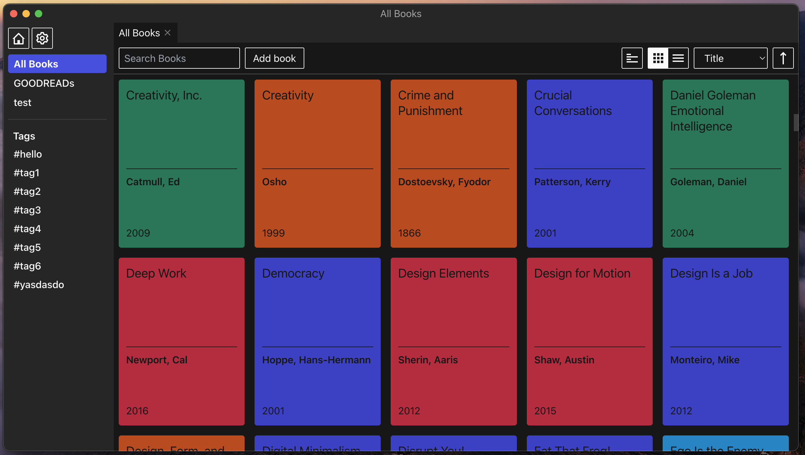
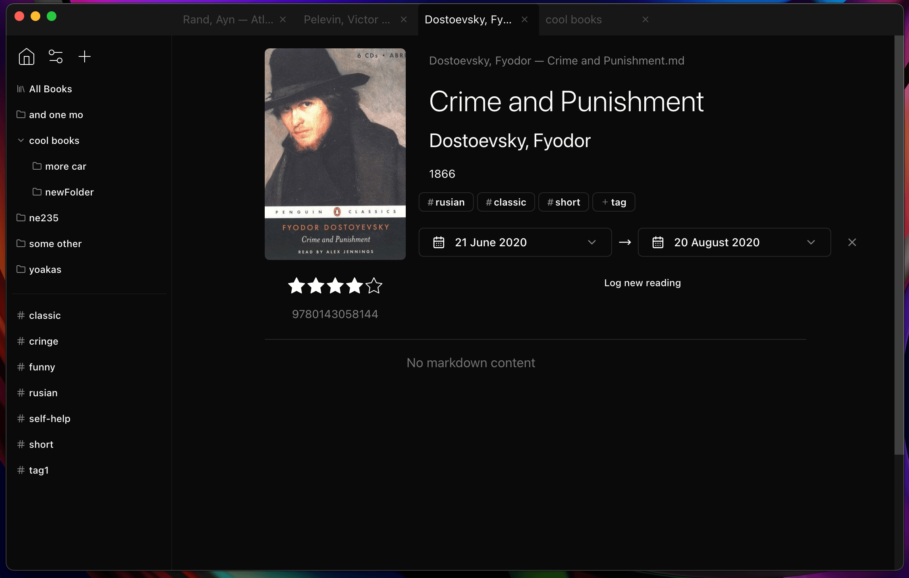

### Current state
updated: 07.10.2023

Had a lot of energy to do stuff recently. Redesigned and improved a lot of thing, will likely do more in the near future.

Currently I plan to get it to "almost as good as a production app" state. Will fix design, add some more features etc. Extensive testing and other boring stuff are unlikely.

### BkzLogger

App to store data about books you've read in plaintext markdown.
Goodreads-like functionality except for all the social stuff.
Integrates perfectly with your markdown notes in Obsidian or similar apps.

### Developing

Use at least node specified in `.nvmrc`

`npm run watch` to run in dev mode

`npm run test` to run e2e tests

`npm run compile` to build for production
